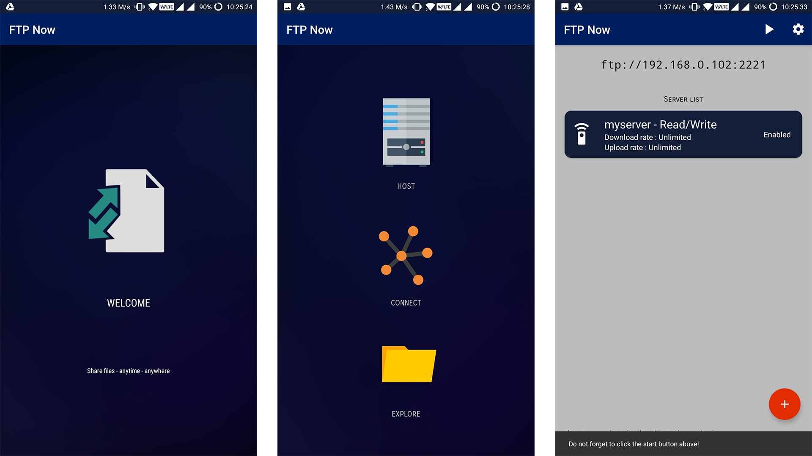
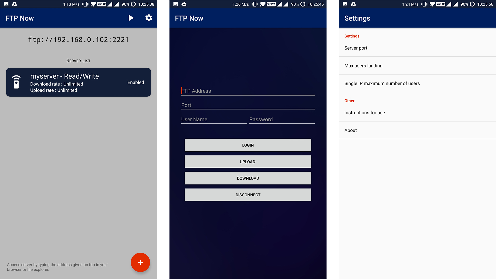

# Welcome to FTPNow!

A simple android **FTP client/server** application that allows the user to do both - host a FTP server for easy file transfer from phone to any other device that can connect to a server as well as connect to server hosted by other device on same network

## Transfer Files

FTPNow allow you to send/receive files from File Transfer Protocol Servers i.e hosted and connected by devices on the same network. Simply type the IP and port displayed to connect to server and easy share files between the devices. 
The number of devices that can be connected at once can be controlled by the user.

## Explore 

It comes with a built in file explorer to easy access the files on your device, modify them (delete, move, rename) and quick selection of file address for quick file transfer.

> **Note:** This feature is currently under development.

# Screenshots
  
 

